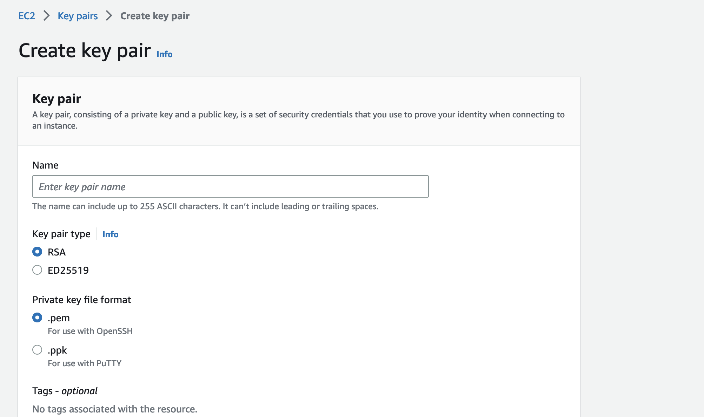
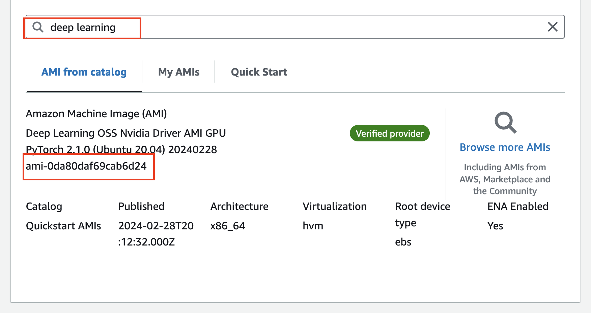
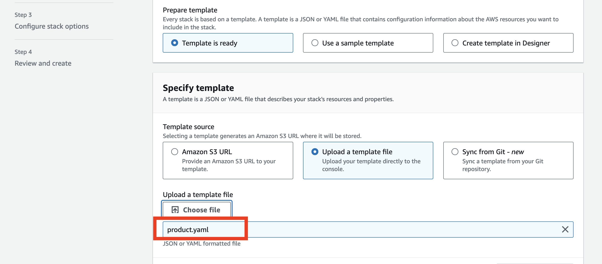
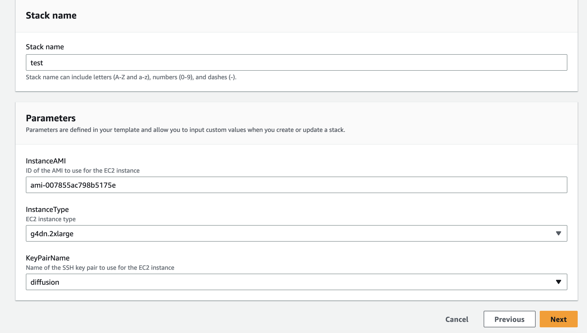
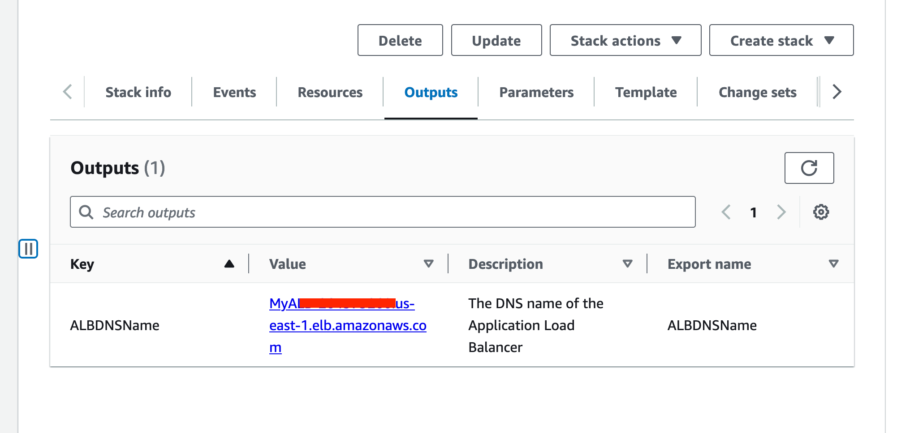
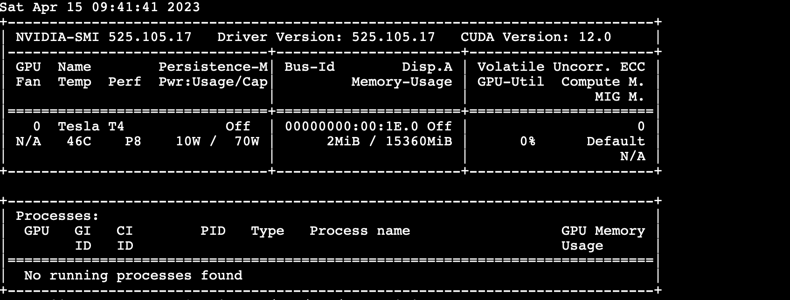
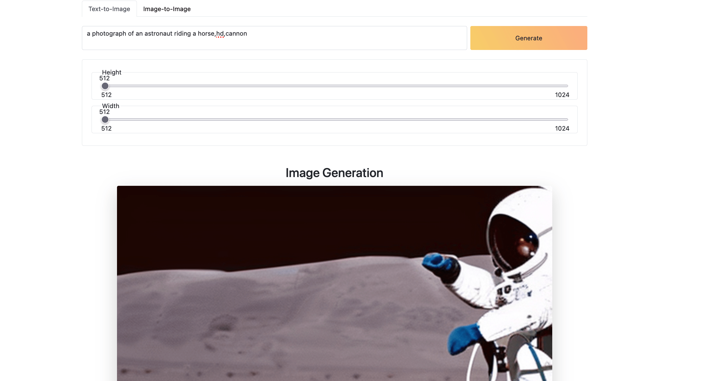
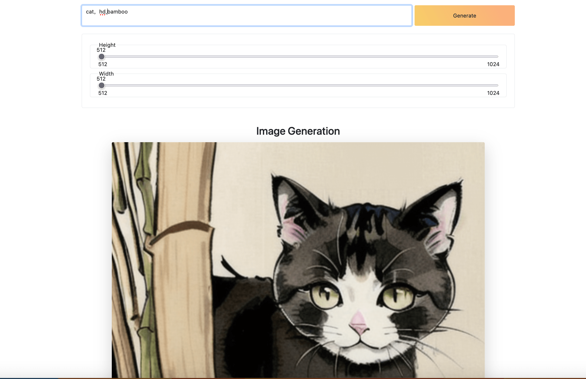

# Stable Diffusion On EC2 jumpstart

**Introduction:**

Through Cloudformation on AWS, create a VPC network environment with one click, and deploy an Auto Scaling Group within it to run applications based on Stable Diffusion.Uses a mixed instances policy, including one always-on On-Demand GPU instance and optional Spot GPU instances to optimize cost.

**Project Includes:**

- **app.py**: A Python application based on Flask, providing a simple Web interface to use the Stable Diffusion model, converting text to images and performing image style transfer.

- **lora.py**: Based on the difffuser library, it implements loading models in the safetensors format and flexibly using models of different styles.

- **frontend**: A simple sample interface to showcase API calls.

- **product.yaml**: An AWS Cloudformation YAML file that automatically provides AWS G4 instances and installs Nvidia drivers and diffuser-related libraries to run `app.py`.

**Cloudformation template(product.yaml) Introduction：**

This is an AWS CloudFormation template used to create a VPC network environment and deploy an Auto Scaling Group to run an application based on Stable Diffusion. Let's analyze this template step by step:

1. **VPC and Network Components**:

   - Creates a VPC and assigns it the CIDR block `10.0.0.0/16`.
   - Creates an Internet Gateway and associates it with the VPC.
   - Creates two public subnets (`10.0.1.0/24` and `10.0.2.0/24`) in different Availability Zones.
   - Creates a route table and adds a default route to route all traffic to the Internet Gateway.
   - Associates the two public subnets with the route table.

2. **Security Groups**:

   - Creates a security group `MyALBSecurityGroup` that allows HTTP (port 80) traffic from any IP address. This will be used for the Application Load Balancer (ALB).
   - Creates another security group `MySecurityGroup` that allows SSH (port 22) traffic from any IP address and TCP port 5000 traffic from `MyALBSecurityGroup`. This will be used for the EC2 instances.

3. **Application Load Balancer**:

   - Creates an Application Load Balancer `MyLoadBalancer` and deploys it in the two public subnets.
   - Creates a target group `MyTargetGroup` for health checks and routing traffic to the EC2 instances.
   - Creates a listener `MyListener` that listens on HTTP port 80 and forwards traffic to the target group.

4. **Launch Template**:

   - Creates a launch template `MyLaunchTemplate` to define the configuration of the EC2 instances.
   - In the launch template, specifies the instance type, AMI ID, key pair name, security group, block device mappings, and user data script.
   - The user data script installs Python, Stable Diffusion and its dependencies, clones the GitHub repository, downloads the model file, and starts a systemd service to run the application.

5. **Auto Scaling Group**:

   - Creates an Auto Scaling Group `MyAutoScalingGroup` with a minimum capacity of 0, a maximum capacity of 1, and a desired capacity of 1.
   - The Auto Scaling Group will launch EC2 instances in the two public subnets.
   - The Auto Scaling Group uses a mixed instances policy, including one always-on On-Demand instance and optional Spot instances to optimize cost.
   - The Auto Scaling Group uses the launch template defined above to launch EC2 instances and registers them with the target group.

6. **Parameters**:
   - The template defines three parameters: AMI ID, key pair name, and instance type.
   - The instance type parameter has a default value of `g5.2xlarge` and limits the allowed values to GPU instance types.

Overall, this CloudFormation template creates a VPC network environment, configures security groups, a load balancer, and an Auto Scaling Group, and deploys a Stable Diffusion-based application within it. It uses GPU instances to accelerate AI model inference and implements auto-scaling through the Auto Scaling Group.

**Install guide：**

- Create life EC2 keypair through AWS Console.

  

- Find the ami id through the console interface:

  

- Create stack in cloudformation console

  

- Set parameter of the project 

  

- Output ALB address after installation:

  

- Run AWS CloudFormation template through the command line, and install and configure AWS CLI.，Refer to[AWS CLI Document](https://docs.aws.amazon.com/cli/latest/userguide/install-cliv2.html)：

bash

```

aws cloudformation create-stack \
  --stack-name my-stack \
  --template-body file://instance.yaml \
  --parameters \
      ParameterKey=InstanceAMI,ParameterValue=your-ami-id \
      ParameterKey=KeyPairName,ParameterValue=my-keypair \
  --capabilities CAPABILITY_IAM


```

Attention：Using Deep Learning OSS Nvidia Driver AMI GPU PyTorch 2.1.0 (Ubuntu 20.04) 20240228 ami id and custom key pair.

delete stack：

bash

```

aws cloudformation delete-stack --stack-name MyStack

```

- Wait around 10 minutes for the EC2 instance to initialize the environment and install the diffusion library.

- Connect to the EC2 instance via SSH and run

```
tail -f /var/log/cloud-init-output.log
```

to monitor the installation progress.

- Connect to the EC2 instance via SSH and

```
run nvidia-smi
```

You should see the NVIDIA system management interface



- Navigate to the Stable-Diffusion-OneClick-AWS directory. The python3 app.py service is already running by default. You can stop the service with sudo systemctl stop myapp.service.

- Access the output domain name

```
http://{ALB Output URL}
```

to see the UI.



- In the Stable-Diffusion-OneClick-AWS directory, first stop the background service with

```
 sudo systemctl stop myapp.service,
```

then run python3 lora.py. This will load the LoRA model and generate ink-style images using the Moxin model



** Sample program description：**

app.py：
Provides two functionalities for users: Text-to-Image (converting text to images) and Image-to-Image style transfer.

- Defines a health check route (/health): Returns a string Healthy and HTTP status code 200, indicating that the application is running normally.

```

@app.post("/txt2img")

def text_to_img():

data = request.json

model_id = "stabilityai/stable-diffusion-2"

output = "output_txt2img.png"


scheduler = EulerDiscreteScheduler.from_pretrained(model_id, subfolder="scheduler")

pipe = StableDiffusionPipeline.from_pretrained(

model_id, scheduler=scheduler, revision="fp16", torch_dtype=torch.float16

)

pipe = pipe.to("cuda")

image = pipe(data["prompt"], height=data["height"], width=data["width"]).images[0]


image.save(output)

return send_file(output), 200

```

When calling the `/txt2img` API, you need to provide a JSON object containing the following parameters:

- `prompt` (string): The text prompt used to generate the image. This is typically a descriptive text representing the scene or objects you want to see in the generated image.

- `height` (int): The desired height of the generated image (in pixels).

- `width` (int): The desired width of the generated image (in pixels).

JSON Example：

```

{

"prompt": "A beautiful sunset over the ocean",

"height": 512,

"width": 768

}


```

In this example, the text prompt is A beautiful sunset over the ocean, and the expected image size is 768 pixels wide and 512 pixels high.

You can call the /txt2img API using a POST request, sending a JSON object as the request body. For example, using the Python requests library, you can call the API like this:

python

```

import requestsimport json


url = "http://instance ip:5000/txt2img"

data = {

"prompt": "A beautiful sunset over the ocean",

"height": 512,

"width": 768

}

headers = {"Content-Type": "application/json"}


response = requests.post(url, data=json.dumps(data), headers=headers)

```

Please note that you need to update the url variable according to the actual deployment URL of your application.

- Define the Image-to-Image route (/img2img): Receive JSON data containing the text prompt for style transfer and the URL of the original image.

```

@app.post("/img2img")

def img_to_img():

data = request.json

model_id = "runwayml/stable-diffusion-v1-5"

output = "output_img2img.png"


pipe = StableDiffusionImg2ImgPipeline.from_pretrained(

model_id, torch_dtype=torch.float16

)

pipe = pipe.to("cuda")

response = requests.get(data["url"])

init_image = Image.open(BytesIO(response.content)).convert("RGB")

init_image = init_image.resize((768, 512))

images = pipe(

prompt=data["prompt"], image=init_image, strength=0.75, guidance_scale=7.5

).images


images[0].save(output)

return send_file(output), 200

```

When calling the `/img2img` API, you need to provide a JSON object containing the following parameters:

- `prompt` (string): The text prompt for performing image style transfer. This is typically a descriptive text representing the style or elements you want to see in the generated image.

- `url` (string): The URL of the original image. The application will download the image from this URL and apply image-to-image style transfer based on it. Make sure the provided URL is an accessible image file address.

- A typical JSON input example:

json

Copy code

```

{

"prompt": "Starry night",

"url": "https://example.com/path/to/image.jpg"

}


```

In this example, the text prompt is Starry night, indicating that we want to transform the original image into a style resembling a starry night. The URL of the original image is https://example.com/path/to/image.jpg.

You can call the /img2img API using a POST request, sending a JSON object as the request body. For example, using the Python requests library, you can call the API like this:

python

Copy code

```

import requestsimport json


url = "http://localhost:5000/img2img"

data = {

"prompt": "Starry night",

"url": "https://example.com/path/to/image.jpg"

}

headers = {"Content-Type": "application/json"}


response = requests.post(url, data=json.dumps(data), headers=headers)

```

**Limit：**

Using the Diffusers package has several limitations, including:

- Inability to directly use models in the safetensors format
- 77 token limit for prompts
- Lack of support for LoRA (Low-Rank Adaptation)
- And lack of an image upscaling feature

- **Enable FP16**, by adding just two lines of code you can boost performance by 100%, while barely affecting image quality.

```

`from diffusers import DiffusionPipeline`

`import torch # <----- Line 1 added`

`pipeline = DiffusionPipeline.from_pretrained(`

` r"D:\sd_models\deliberate_v2"`

` ,torch_dtype = torch.float16 # <----- Line 2 Added`

`)`

`pipeline.to("cuda")`

`image = pipeline("A cute cat playing piano").images[0]`

`image.save("image_of_cat_playing_piano.png")`

```

- **Xformers**

Xformers is an open-source library that provides a set of high-performance transformers for various natural language processing (NLP) tasks. Built on top of PyTorch, it aims to deliver efficient and scalable transformer models that can be easily integrated into existing NLP pipelines.

```

`...`

`pipeline.to("cuda")`

`pipeline.enable_xformers_memory_efficient_attention() <--- one line added`

`...`

```

- Remove the token limit:：

By utilizing the community-provided "lpw_stable_diffusion" pipeline, you can unlock the 77 token limit, enabling the generation of high-quality images with longer prompts.

```

`pipeline = DiffusionPipeline.from_pretrained(`

` model_path,`

` custom_pipeline="lpw_stable_diffusion", #<--- code added`

` torch_dtype=torch.float16`

`)`

```

- Using LoRA with diffusers: You can refer to the lora.py file, which allows users to load LoRA files in real-time. This feature enables loading LoRA files and their corresponding weights into the diffusion model, enabling the generation of high-quality images using the LoRA data.

```

from safetensors.torch import load_file

def __load_lora(

pipeline

,lora_path

,lora_weight=0.5

):

state_dict = load_file(lora_path)

LORA_PREFIX_UNET = 'lora_unet'

LORA_PREFIX_TEXT_ENCODER = 'lora_te'


alpha = lora_weight

visited = []


# directly update weight in diffusers model

for key in state_dict:

# as we have set the alpha beforehand, so just skip

if '.alpha' in key or key in visited:

continue

if 'text' in key:

layer_infos = key.split('.')[0].split(LORA_PREFIX_TEXT_ENCODER+'_')[-1].split('_')

curr_layer = pipeline.text_encoder

else:

layer_infos = key.split('.')[0].split(LORA_PREFIX_UNET+'_')[-1].split('_')

curr_layer = pipeline.unet


# find the target layer

temp_name = layer_infos.pop(0)

while len(layer_infos) > -1:

try:

curr_layer = curr_layer.__getattr__(temp_name)

if len(layer_infos) > 0:

temp_name = layer_infos.pop(0)

elif len(layer_infos) == 0:

break

except Exception:

if len(temp_name) > 0:

temp_name += '_'+layer_infos.pop(0)

else:

temp_name = layer_infos.pop(0)

# org_forward(x) + lora_up(lora_down(x)) * multiplier

pair_keys = []

if 'lora_down' in key:

pair_keys.append(key.replace('lora_down', 'lora_up'))

pair_keys.append(key)

else:

pair_keys.append(key)

pair_keys.append(key.replace('lora_up', 'lora_down'))

# update weight

if len(state_dict[pair_keys[0]].shape) == 4:

weight_up = state_dict[pair_keys[0]].squeeze(3).squeeze(2).to(torch.float32)

weight_down = state_dict[pair_keys[1]].squeeze(3).squeeze(2).to(torch.float32)

curr_layer.weight.data += alpha * torch.mm(weight_up, weight_down).unsqueeze(2).unsqueeze(3)

else:

weight_up = state_dict[pair_keys[0]].to(torch.float32)

weight_down = state_dict[pair_keys[1]].to(torch.float32)

curr_layer.weight.data += alpha * torch.mm(weight_up, weight_down)

# update visited list

for item in pair_keys:

visited.append(item)

return pipeline

```

```

@app.post("/txt2img")

def text_to_img():

data = request.json

model_id = "XpucT/Deliberate"

output = "output_txt2img.png"


scheduler = EulerDiscreteScheduler.from_pretrained(model_id, subfolder="scheduler")


pipe = StableDiffusionPipeline.from_pretrained(

model_id,

subfolder="scheduler",

custom_pipeline = "lpw_stable_diffusion" ,

torch_dtype = torch.float16,

)

lora = (r"./moxin.safetensors",0.8)

pipe = __load_lora(pipeline=pipe,lora_path=lora[0],lora_weight=lora[1])


pipe = pipe.to("cuda")

#pipe.enable_xformers_memory_efficient_attention()

image = pipe(data["prompt"], height=data["height"], width=data["width"]).images[0]


image.save(output)

return send_file(output), 200

```

You can achieve a mixed model mode by calling \_\_load_lora() multiple times to load different LoRA models.
